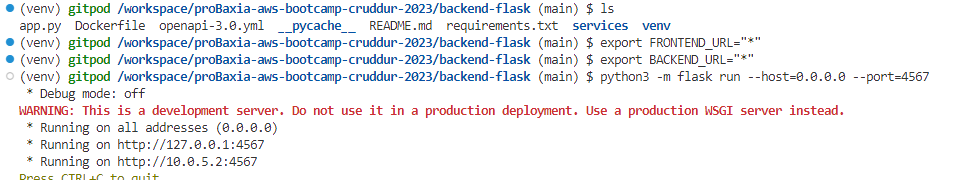
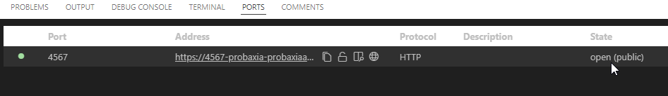
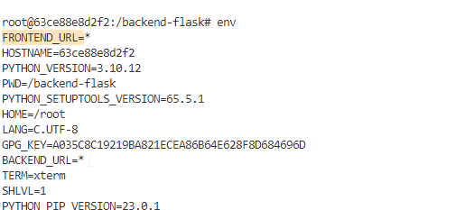
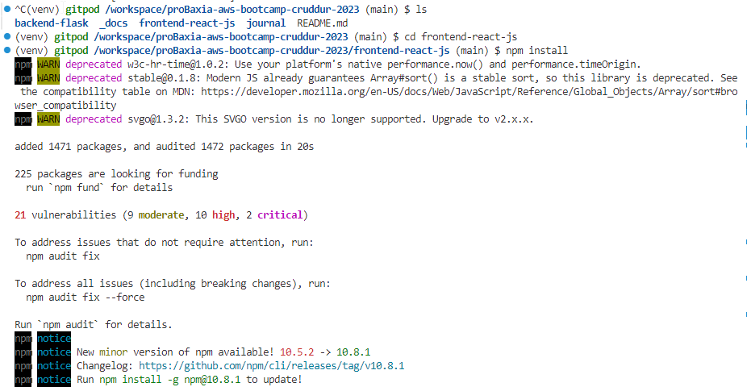

# Week 1 — App Containerization

clone the repo from [github](https://github.com/proBaxia/proBaxia-aws-bootcamp-cruddur-2023)

cd into backendend 

create a Dockerfile 

~~~
FROM python:3.10-slim-buster

WORKDIR /backend-flask

COPY requirements.txt requirements.txt

RUN pip install -r requirements.txt

COPY . .

ENV FLASK_ENV=development

EXPOSE ${port}

CMD [ "python","-m","flask","run","--host=0.0.0.0","--port=4567"  ]

~~~

# Install python version
```
pyenv install 3.10.9
```

# Set your python version
```
pyenv global 3.10.9
```

# Create virual environment
```
python -m venv venv
```

# Activate environment
```
source venv/bin/activate
```

# Install Flask
```
pip install flask
```


## Export your variables into your terminal
export FRONTEND_URL="*"
export BACKEND_URL="*"
## Bring on the app by runing the code below 
python3 -m flask run --host=0.0.0.0 --port=4567




- make sure to unlock the port on the port tab
- open the link for 4567 in your browser
- append to the url to /api/activities/home
you should get back json
- on your port make sure your port state is public and click on the link on your port Address 



- you will get a link like this 

 https://4567-probaxia-probaxiaawsboo-sue6j7331dj.ws-eu114.gitpod.io/

- when you click on it it will give you error like this 


so add the `/api/activities/home` to your url 

https://4567-probaxia-probaxiaawsboo-sue6j7331dj.ws-eu114.gitpod.io/api/activities/home


## Build container
- FIRST delete the environment variables  BACKEND and FRONEND
```
unset BACKEND
unset FRONEND
```
- Lets work on the Dockerfile we created to containerization our application 

- build your app with docker build  
move back ousside your director backend-flask and run this code to build your docker images  

~~~
docker build -t  backend-flask ./backend-flask
~~~
check if your docker has build your images 
~~~
docker images
~~~


## Run Container
~~~
docker container run --rm -p 4567:4567  backend-flask
~~~

- make sure to unlock the port on the port tab
- open the link for 4567 in your browser
- on your port make sure your port 4567  state is public and click on the link on your port Address url


- when you click on it it will give you error like this 


- reason we are getting this error is because we haven't set the environment variables 
so let run this command 
~~~
FRONTEND_URL="*"BACKEND_URL="*" docker container run --rm -p 4567:4567 backend-flask
~~~
stil not working lets check if the environment variables is save by going to tha icon of docker in your vscode/gitpod click on containers and right click on backend-flask attach shell . on the attach shell  terminal type env to view your environment variables
~~~
env 
~~~


- run this code to in put your environment variables 
~~~
docker container run --rm -p 4567:4567  -e FRONTEND_URL='*' -e BACKEND_URL='*' backend-flask
~~~
- check docker attach shell you will find environment variables `FRONTEND_URL=* BACKEND_URL=*`



- on your terminal port make sure your port 4567  state is public and click on the link on your port Address url


- Add `/api/activities/home` to the back of your url , something like this

https://4567-probaxia-probaxiaawsboo-sue6j7331dj.ws-eu114.gitpod.io/api/activities/home

## Get Container Images or Running Container Ids
docker ps
docker images

## Containerize Frontend
### RUN NPM Install
We have to run NPM Install before building the container since it needs to copy the contents of node_modules
~~~
cd frontend-react-js
npm i
~~~

### Create Docker File
Create a file here: frontend-react-js/Dockerfile

~~~
FROM node:16.18

ENV PORT=3000

COPY . /frontend-react-js
WORKDIR /frontend-react-js
RUN npm install
EXPOSE ${PORT}
CMD ["npm", "start"]
~~~

### Multiple Containers
Create a docker-compose file
Create `docker-compose.yml` at the root of your project to run backend and frontend together 

~~~
version: "3.8"
services:
  backend-flask:
    environment:
      FRONTEND_URL: "https://3000-${GITPOD_WORKSPACE_ID}.${GITPOD_WORKSPACE_CLUSTER_HOST}"
      BACKEND_URL: "https://4567-${GITPOD_WORKSPACE_ID}.${GITPOD_WORKSPACE_CLUSTER_HOST}"
    build: ./backend-flask
    ports:
      - "4567:4567"
    volumes:
      - ./backend-flask:/backend-flask
  frontend-react-js:
    environment:
      REACT_APP_BACKEND_URL: "https://4567-${GITPOD_WORKSPACE_ID}.${GITPOD_WORKSPACE_CLUSTER_HOST}"
    build: ./frontend-react-js
    ports:
      - "3000:3000"
    volumes:
      - ./frontend-react-js:/frontend-react-js

# the name flag is a hack to change the default prepend folder
# name when outputting the image names
networks: 
  internal-network:
    driver: bridge
    name: cruddur
~~~



### Build Container
~~~
docker build -t frontend-react-js ./frontend-react-js
~~~
### Run Container
~~~
docker run -p 3000:3000 -d frontend-react-js
~~~
#### we can use `docker compose up / docker-compose up` to build and run the Container 
~~~
docker-compose up
docker compose up
~~~


- on your port make sure your port 3000 state is public and click on the link on your port Address 


### FORNTEND APPLICATION VIEW 


# Week 1 - Create the notification feature (Backend and Front)

if i click on notification button 


no page to display notification 


let's add an endpoint to our notification 🔔 button 
go to our working directory cd into `backend-flask` open the `openapi-3.0.yaml` file. on vscode click on ~Api~ extension make sure you have install the extention OpenAPI (Swagger) on your vscode or gitpod click on ~Paths~ create a part and name it `/api/activities/notifications` see thr image below 


open api for notifications sorce code 
~~~sh
 /api/activities/notifications:
    get:
      description: 'Return a field of activities for all of those that i  follow'
      tags:
        - activities
      parameters: []
      responses:
        '200':
          description: Return an array of activities 
          content:
            application/json:
             schema:
               type: array
               items:
                 $ref: '#/components/schemas/Activity"
~~~

## lets define a new endpoint 
The entries of our application is app.py 

go to your working directory  `backend-flask` on  `app.py` copy the code below to your app.py


create a `notifications_activities.py` on your `services` folder in your backend-flask working directory 

go to your working directory  `backend-flask` on  `app.py` copy the code below to your app.py

~~~sh
@app.route("/api/activities/notifications", methods=['GET'])
def data_notifications():
  data = NotificationsActivities.run()
  return data, 200
~~~


add this to your app.py
~~~sh
from services.notifications_activities import *
~~~


copy the code below to your  `activities-notifications.py` we created 

~~~sh
from datetime import datetime, timedelta, timezone
class NotificationsActivities:
  def run():
    now = datetime.now(timezone.utc).astimezone()
    results = [{
      'uuid': '68f126b0-1ceb-4a33-88be-d90fa7109eee',
      'handle':  'Gabriel Akintade',
      'message': 'Cloud is fun and i need a cloud role!',
      'created_at': (now - timedelta(days=2)).isoformat(),
      'expires_at': (now + timedelta(days=5)).isoformat(),
      'likes_count': 5,
      'replies_count': 1,
      'reposts_count': 0,
      'replies': [{
        'uuid': '26e12864-1c26-5c3a-9658-97a10f8fea67',
        'reply_to_activity_uuid': '68f126b0-1ceb-4a33-88be-d90fa7109eee',
        'handle':  'Worf',
        'message': 'This post has no honor!',
        'likes_count': 0,
        'replies_count': 0,
        'reposts_count': 0,
        'created_at': (now - timedelta(days=2)).isoformat()
      }],
    },
    {
      'uuid': '66e12864-8c26-4c3a-9658-95a10f8fea67',
      'handle':  'Worf',
      'message': 'I am out of prune juice',
      'created_at': (now - timedelta(days=7)).isoformat(),
      'expires_at': (now + timedelta(days=9)).isoformat(),
      'likes': 0,
      'replies': []
    },
    {
      'uuid': '248959df-3079-4947-b847-9e0892d1bab4',
      'handle':  'Garek',
      'message': 'My dear doctor, I am just simple tailor',
      'created_at': (now - timedelta(hours=1)).isoformat(),
      'expires_at': (now + timedelta(hours=12)).isoformat(),
      'likes': 0,
      'replies': []
    }
    ]
    return results
~~~

when i want to start my backend-flask `python -m flask run --host=0.0.0.0 --port=
4567`i encounter this error bellow 


my moulde was unable to import my `/api/activities/notifications:` we created because this what i wrote `from services.notifications_activity import *` instaed of `services.notifications_activities import *` i have updated it from  app.py file
now lets run our backend-flask
~~~
python -m flask run --host=0.0.0.0 --port=4567
~~~
i got this error.


just because i did not call my api moudle i want to call which is `/api/activities/notifications` add it to the end of your URL 


